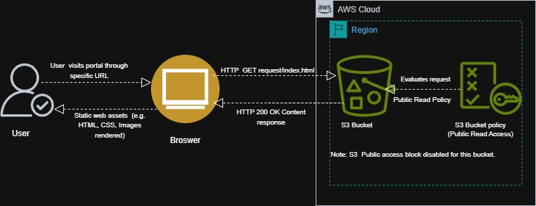
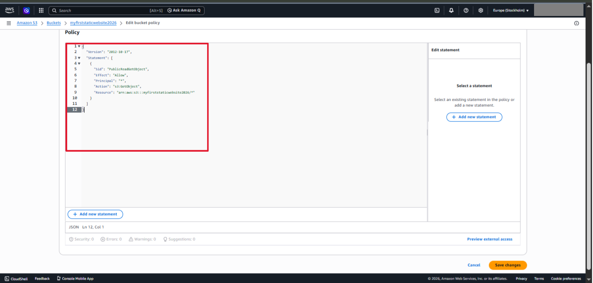

# **Project Overview**

This project demonstrates hands-on experience in deploying a fully functional static website using an Amazon S3 bucket. The main objective is to implement a cost-effective, highly available, serverless hosting solution while applying appropriate access control and configuration best practices.

The implementation covers bucket provisioning, controlled public access, bucket policy configuration, static web hosting, and content deployment.

---

# **Architecture**

This solution utilizes a simple serverless architecture:

* A client (web browser) sends a request to the S3 website endpoint  
* The bucket retrieves and serves static content (HTML, CSS, JavaScript)  
*  Access is controlled via a bucket policy granting public read-only access

<p align="center">
  
</p>

***Figure 1:*** *Architecture of static website hosting using Amazon S3. This diagram demonstrates how client requests are served directly from the S3 endpoint.*

# **Prerequisites**

Before implementing this solution, the following requirements should be met:

*	An active AWS account with access to the AWS management console. 
*	Basic familiarity with cloud concepts and object storage. 
*	Permissions that allow for the creation and configuration of bucket resources. 
*	Static website files ready for deployment (e.g., index.html, CSS, JavaScript assets).
  
# **Implementation**

* A bucket was provisioned with the following configuration:
*	Bucket type set to General Purpose
* A globally unique bucket name is assigned. 
* Access Control Lists (ACLs) were disabled to ensure centralized access management via the bucket policies.
  
The above-mentioned configurations align with AWS best practices for simplified and secure permission control. 

<p align="center">
  
</p>

***Figure 2:*** *S3 bucket configuration with ACLs disabled. Shows the bucket setup with modern access control configurations applied.*

# **Public Access Configuration**

Public access settings were adjusted to support static website hosting:
* Block Public Access is disabled. 
* Access is restricted using a bucket policy granting read-only permissions.
  
This is important as it ensures that access is enabled, while limiting exposure to only necessary actions.

<p align="center">
  
</p>

***Figure 3:*** *Public access settings configured for static website hosting, enabling controlled public read access for content delivery.* 

# **Static Website Hosting Setup**
Static website hosting was enabled on the bucket:
*	Hosting feature activated
*	Index document defined (index.html)
  
This allows the bucket to serve the web content over HTTP via the bucket website endpoint. 

<p align="center">
  
</p>

***Figure 4:*** *Static website hosting enabled with an index document defined. This displays the configuration required for serving the web content.*

# **Bucket Policy Configuration**
* A bucket policy was configured to allow public read access.
* Permission granted: s3:GetObject
* The scope is limited to only objects within the bucket.
  
This allows the users to retrieve content without exposing write or administrative permissions. 

<p align="center">
  
</p>

***Figure 5:*** *Bucket policy granting public read access. Demonstrates controlled public access using a resource-based policy.*

Here’s the policy extracted from the image:

Here’s the policy extracted from the image:
## **The Policy**

```json
{
  "Version": "2012-10-17",
  "Statement": [
    {
      "Sid": "PublicReadGetObject",
      "Effect": "Allow",
      "Principal": "*",
      "Action": "s3:GetObject",
      "Resource": "arn:aws:s3:::myfirststaticwebsite2026/*"
    }
  ]
}
```
#### Line-by-Line Breakdown

- **Version**

Specifies the policy language version used by AWS. The value "2012-10-17" is the standard and current version for IAM policies. 

- **Statement**

Contains one or more permission rules. In this case, a single statement defines the access control behavior. 

- **Sid (Statement ID)**

A unique identifier for the policy statement. It is optional and used for readability and management. 

- **Effect**

Defines whether the rule allows or denies access.

In this policy, "Allow" grants permission to perform the specified action. 

- **Principal**

Specifies who the policy applies to.
The value "*" means the rule applies to all users (public access). 

- **Action**

Defines the operation that is permitted.
"s3:GetObject" allows users to retrieve (read/download) objects from the bucket. 

- **Resource**

Specifies the scope of the policy.
"arn:aws:s3:::myfirststaticwebsite2026/*" applies the rule to all objects within the bucket.

# **Deployment And Verification**
* HTML, CSS, and supporting assets were uploaded to the bucket.
* Website endpoint URL retrieved from the bucket properties.
* Deployment validated by accessing the website via a browser. 

<p align="center">
  
</p>
